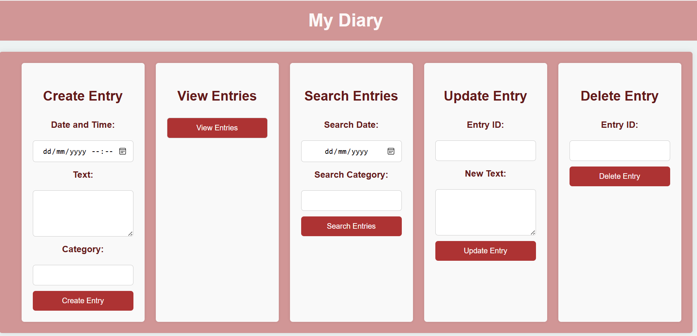

# Diary App

The Diary App is a web-based application that allows users to create, edit, and delete diary entries. Each entry can be categorized and searched by date or category.

## Features

- Create new diary entries with date, text, and category.
- Edit existing entries.
- Delete unwanted entries.
- Search entries by date or category.
- Responsive design using Bootstrap.

## Technologies Used

- HTML5
- CSS3
- JavaScript (ES6)
- Bootstrap 5
- Node.js (Backend API for handling entries)

## Live Deployment

You can view the live version of the Diary App at the following URL:"https//diary-app-kh6l.onrender.com"

## How to Use

1. **Access the App**: Visit the live app using the link above.
2. **Features**: Users can create, read, update, and delete diary entries.

### Running Locally

To run this application locally:

1.Clone the Repository
2.Install Dependencies

cd diary-app
npm install

3.Run the Application

npm start
Open "https//localhost:3000" in your browser.

### Configuration

Ensure you have the following environment variables set in your .env file:

DATABASE_URL=your-database-url
SECRET_KEY=your-secret-key
